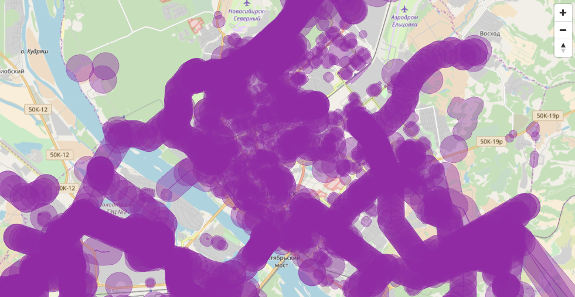

Usage
=====

Install everything:

    $ npm install

Run vector tiling:

    $ npm run seed

if it doesn't run complaining node doesn't exist, do this first:

    $ sudo apt install nodejs-legacy
    
Run simple server to check results:

    $ npm run server

Open [http://localhost:3000](http://localhost:3000)

**Warning:** If you downloaded new source files don't forget to transform them 
into EPSG:4326 before starting the seeding process. You can do it with ogr2ogr:

    $ ogr2ogr -f GeoJSON -s_srs EPSG:3857 -t_srs EPSG:4326 zones.json zones_source.json
    $ ogr2ogr -f GeoJSON -s_srs EPSG:3857 -t_srs EPSG:4326 cities.json cities_source.json

